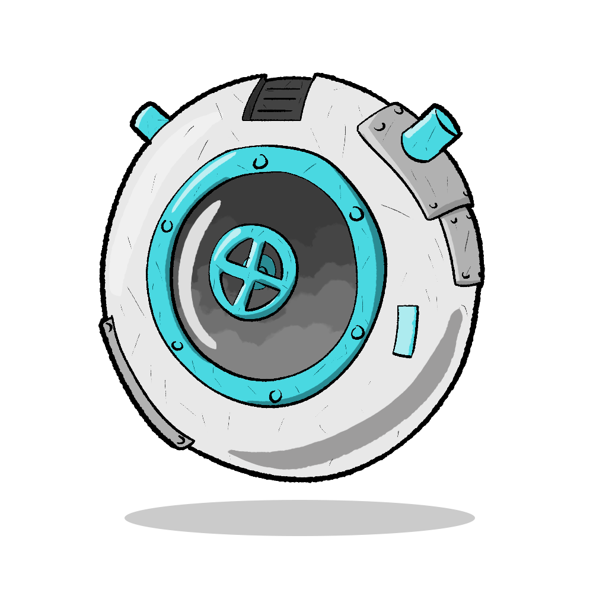

# HeatExchangeNotIncluded_StorageBin

**Please let me know if you find any bugs or this makes your game crash**

<code></code>

## Description

The **Insulate Storage Bin** mod introduces a new building to the game: the *Insulate Storage Bin*. 
This building is designed to prevent stored items from exchanging heat and emitting heat into the environment. 
By isolating the thermal properties of stored items, the mod helps to improve thermal efficiency and reduce unnecessary heat load during late-game scenarios.
I set the building material to Insulite because it matches both the late game and the insulation concept for this building. 
Might add a option menu for the mod to let uses choose if they want this kind of balance setting.

## Support

Both *DLC* and *VANILLA*.

Lastest Game Patch Tested: [Game Hotfix] - 652372

## Installation (You can skip those if using Steam workshop)

1. **Compile the Mod:**  
   Build the project in Visual Studio to generate the DLL (e.g., `HeatExchangeNotIncluded_StorageBin.dll`).

2. **Package the Mod:**  
   Create a mod folder that includes at least the following files:
   - `modinfo.json` or `mod.yaml`
   - `HeatExchangeNotIncluded_StorageBin.dll`

3. **Copy the Mod:**  
   Place the mod folder in the game's mods directory:  
   **Windows:** `%LocalPath%\Documents\Klei\OxygenNotIncluded\mods`

4. **Enable Mods:**  
   Launch Oxygen Not Included with mods enabled. Your new building should appear under the *Base* category in the build menu.

## Acknowledgements

This mod makes reference to code from the [MoveThisHere](https://github.com/DoctorFeelGoodMD/OxygenNotIncluded-Mods/tree/main/mods/MoveThisHere) repository by **DoctorFeelGoodMD**. 
I would like to thank DoctorFeelGoodMD for open-sourcing his project and providing a great foundation for mod development in Oxygen Not Included.
